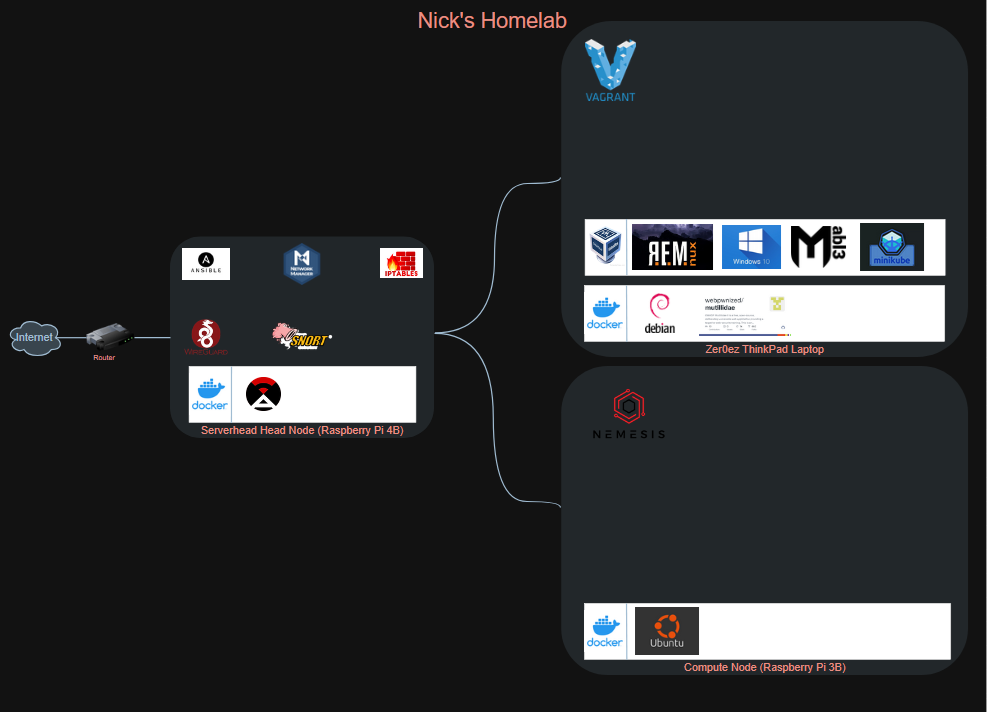

# Nick's Homelab
What is a homelab?

A homelab is a laboratory at home where you can self-host, experiment with new technologies, develop your skills, and lots else. 

## Overview
This is the repository I developed during summer 2025. The homelab consists of the following hardware:
1. Raspberry Pi 4B
2. Raspberry Pi 3B
3. Levono ThinkPad T560
4. TPLink TL-SF1005P Unmanaged Switch

As you can see, it does not consist of much hardware😂. However, you might be suprised how much you can do and learn on such limited hardware.

## Diagram

Below is the diagram of my homelab, as well as some of the programs and containers that are running on each device.

## Tech Stack
| Logo | Name  | Description |
| :-----: | :---: | :---: |
| &nbsp; | Ansible  | Automate OS Updates |
| &nbsp; | NetworkManager | Network Configuration of Head Node and Compute Nodes |
| &nbsp; | IPTables | Firewall Rules for Head Node Traffic |
| &nbsp; | WireGuard | Remote Access to Homelab |
| &nbsp; | Snort | Intrusion Detection for Head Node |
| &nbsp; | Docker | Containerization for all Devices |
| &nbsp; | NetAlertX | Homelab Overview and Management Running on Head Node |
| &nbsp; | Vagrant | Virtual Machine Management for ThinkPad |
| &nbsp; | VirtualBox | Virtualization for Hardware |
| &nbsp; | Nemesis | Network IP Suite |
